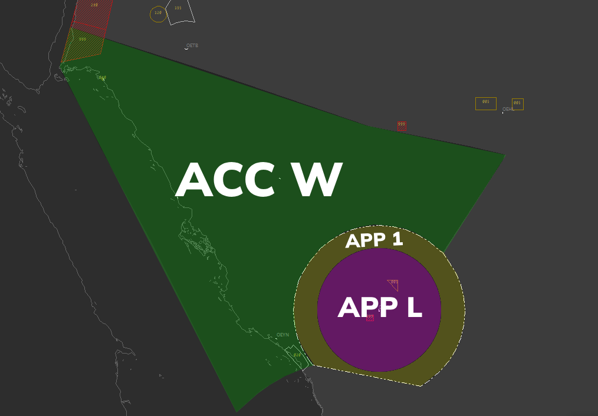

**OEMA_APP [Madinah Approach Upper]**  is in charge of the **Madinah CTA** from **FL150** to **FL245**. 

---

### Airspace Classification/Limit(s)

* **FL150-FL245:** Class A airspace

  

  
*Figure 1 - ACC DOAR*

---
### Notes

- The main purpose of **APP 1** during events is to finalize the sequencing prepared by **ACC W** and ensure adequate separation before transferring the traffic to **APP L**.
- It is crucial to maintain a minimum separation of **10-15 nautical miles** horizontally or **1000 feet** vertically between aircraft within the airspace at all times.
- The callsign **"Madinah Approach"** must be used during communications.
- The current **ATIS** information, runway, and approach the pilot must fly must be issued by **APP 1**. The **STAR** is issued by **ACC W**.
- **APP 1** must ensure the traffic is separated by a minimum of **10-15nm** prior to entering the **Madinah TMA**. If not achieved, **APP 1** must not allow the traffic to enter the CTA and resequence them or coordinate with **APP L**.
- In the case of any need for arrival holds, they must be directed to **ORLIG** and enter an unpublished hold over the Madinah TMA between **FL160** and **FL240** (Within **APP 1's Airspace**). **APP 1** must not descend the traffic below **FL150** until approved by **APP L**, after which the traffic can join the published hold between **8000-12000** over **ORLIG** and be transferred to **APP L**. This should be used as a last-ditch effort for such a scenario. Do not overuse Holds.
- Traffic entering the **TMA** must not be faster than **230kts**. **APP 1** must instruct all pilots to maintain **230knots** before the traffic enters the TMA.
- All Traffic must be cleared and passing **FL160** prior to entering the **Madinah TMA**.
- Traffic above **FL200** must not enter the TMA and should be resequenced or coordinated with **APP L**.
- When transferring traffic to **APP L**, **APP 1** must tell the pilots to contact using their callsign only. E.g. > *SVA123, Contact Approach 127.7, Callsign Only*

---

### What to Expect

- All traffic will enter the **Madinah CTA** via **TULOK** around **FL240** and then enter the TMA via **BOVET**.
- All traffic will enter the **Madinah CTA** at a speed at or below **280kts**.