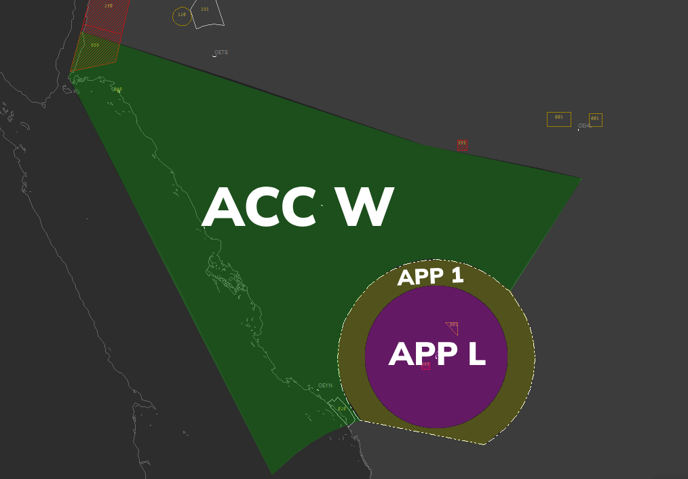

**OEMA_APP [Madinah Approach Lower]**  is in charge of the **Madinah TMA** upto **FL155**. 

::::danger DO NOTE

This document serves as supplementary information for the **Cross The Land 24E** Event and outlines the general plan for flow management. It does not replace or act as a **Standard Operating Procedure (SOP)**. Reading this document does not exempt you from participating in the controller briefing meeting as required.
::::
---

### Airspace Classification/Limit(s)

* **750ft-FL155:** Class C airspace

  

  
*Figure 1 - ACC DOAR*

---
### Notes

* APP L will control the traffic on their STAR.
* It is crucial to maintain a minimum separation of 10-15 nautical miles horizontally or 1000 feet vertically between aircraft within the airspace at all times.
* The callsign **"Madinah Approach"**/**Madinah Director** must be used during communications.
* In the case of any need for arrival holds, they must be directed to ORLIG and enter and the published hold between 8000-12000 over ORLIG. This be used a last ditch effort for such a scenerio. do not overuse Holds.
* Traffic entering the downwind leg of RWY 17 must at a speed of 220knots or lower.
* Traffic entering the downwind leg of RWY 35 must at a speed of 230knots or lower.
* Go around must be taken to the downwind opposite of the one used for the main stream of traffic and be radar vectored As soon as possible back to the ILS.
* Traffic above **FL200** must not enter the TMA and be resequenced or coordinated with APP L.
* When traffic is established, APP L must release the tag.
* Speed restrictions must be enforced until 4 DME final during peak times.
* If need be, traffic may be vectored from **MA420** to **MA401** to join the right downwind of RWY 17 during 17 Config. ** DO NOT DO THIS IF THERE IS A GO AROUND/DEPARTURES**
---
### What to Expect

* All traffic will enter the TMA via **BOVET**.
* All traffic will enter the Madinah TMA at a speed at or below **250kts**.
* All traffic will contact using their callsign only.
* All traffic will have their arrival clearance inculding their STAR, RWY, ATIS Information and APP Type.
