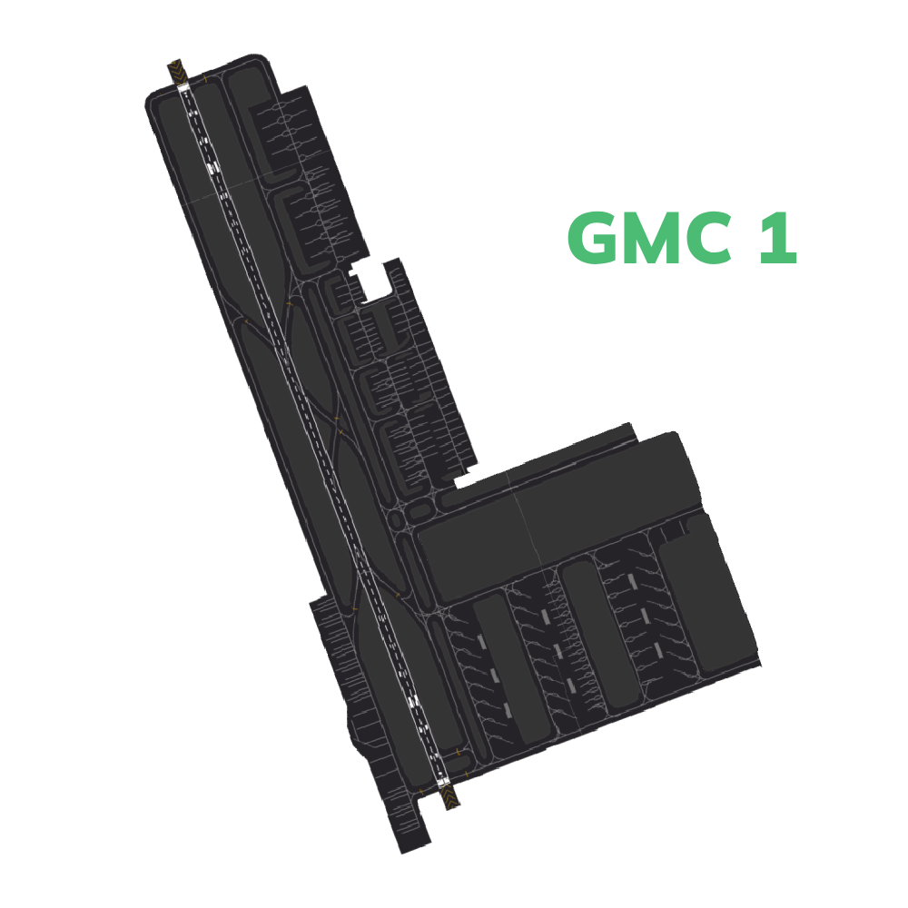
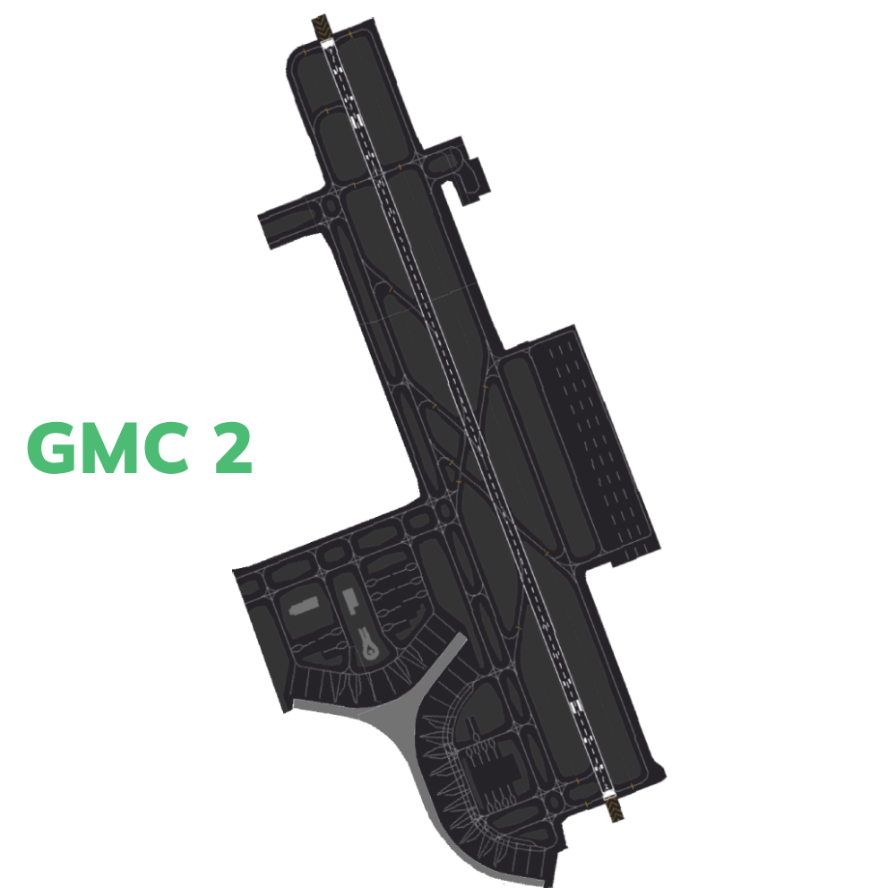
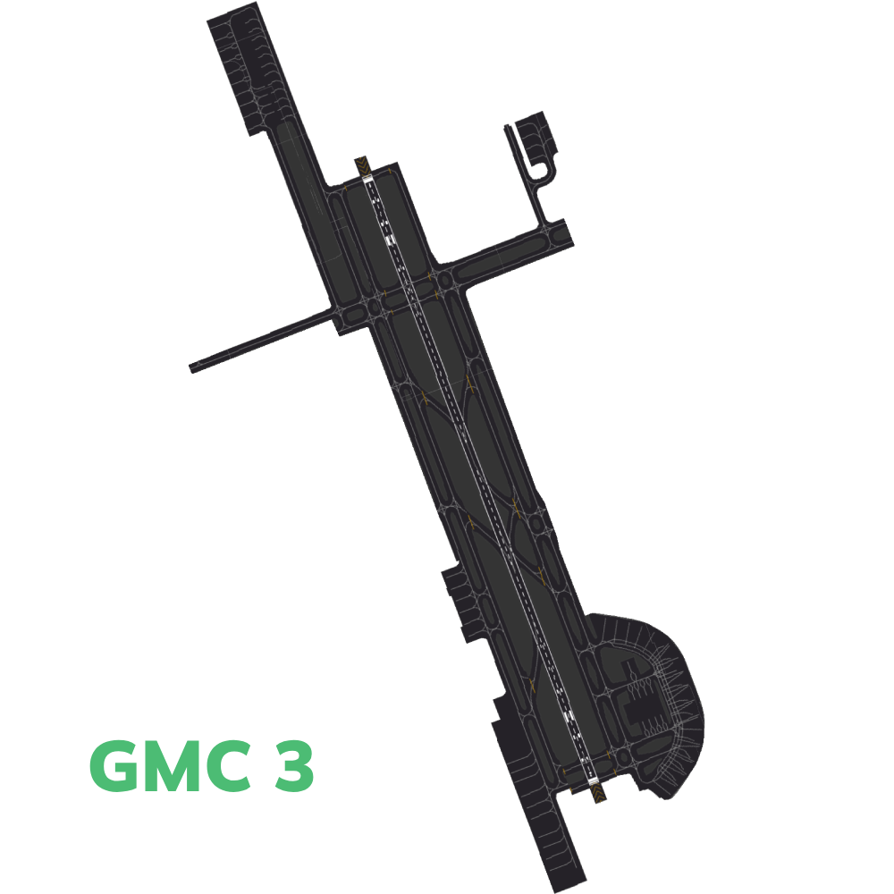

# Jeddah Ground [OEJN_X_GND]

This section details all the necessary Standard Operating Procedures for Ground Operations in **King Abdulaziz International Airport (OEJN)**

---

## 1. General Provisions

The Jeddah Ground manages aircraft movements on aerodrome areas, excluding runways and their associated taxiways. Departing aircraft receive pushback and taxi instructions to the runway holding point, while arriving aircraft are assigned a stand and given taxi instructions.

---
## 2. Designated Areas of Responsiblity 
**King Abdulaziz International Airport (OEJN)** features three primary Ground Movement Control (GMC) positions, namely **GMC 1**, **GMC 2** and **GMC 3**. The responsibilities and areas of control for each position are outlined as follows:

### 2.1 GMC 1 [Jeddah Ground West]
Jeddah Ground West covers western side of the aerodrome which includes the following aprons and its assoicasted taxiways:

- Apron 8 [Royal Apron]
- Apron 7 [Hajj Apron]
- Apron G [General Aviation Apron]
- Apron 5, 4, 3, 2, 1 [Old Terminal, International]
- Apron 13

::::info Bandbox Position

**Jeddah Ground West [OEJN_1_GND]** is the Bandbox Position for ground operations at King Abdulaziz International Airport. This means that when other Ground Movement Control (GMC) positions are offline, OEJN_1_GND is responsible for controlling all aprons and taxiways.

::::

  
* 2.1.1 - Jeddah Ground West AOR*

### 2.2 GMC 2 [Jeddah Ground East]

**Jeddah Ground East [OEJN_2_GND]** covers eastern side of the aerodrome which includes the following aprons and its assoicasted taxiways:

- Apron A,C [Terminal 1]
- Apron 12 [Military Apron]

  
*Figure 2.1.2 - Jeddah Ground East AOR*

### 2.3 GMC 3 [Jeddah Ground Center]

**Jeddah Ground Center [OEJN_3_GND]** covers central part of the aerodrome which includes the following aprons and its assoicasted taxiways:

- Apron B [Terminal 1]
- Apron 9 [Cargo Apron]
- Apron 6 [Hajj Apron]
- Apron 14 [Royal Hanger]
- Apron 11 [Hanger]

  
*Figure 2.1.3 - Jeddah Ground Center AOR*

### 2.4 Splitting Positions
---

## 3.  Procedures
The below procedures are considered as standard and no coordination is required to employ them, except where explicitly required.

::::caution 
Should a situation arise that does not match any of the below cases, coordinate an arrangement with the affected agencies
::::
### 3.1 Push-back Procedures

Aircraft transferred from the Ground Movement Planner (GMP) should be fully prepared for pushback and have reached their Target Off-Block Time (TOBT). If there are no obstructions, they will be instructed to push back immediately. 

However, if an aircraft requesting pushback is not using the correct transponder code, they must be instructed to squawk the correct code before moving.

Aircraft are issued pushback clearances by the GMC controlling the respective apron that the aircraft is parking at.

The pushback direction is based primarily on aircraft location, runway configuration and the apron's flow direction.

#### 3.1.1  Apron Flow Direction

The apron's flow direction can be determined by examining the taxiway diagrams outlined in the **[TWR] Tower** section of this aerodrome's SOP.

By looking at the entry and exit taxiways of the apron, it is very obvious what the direction that all traffic should face.
|       **Apron(s)**       |     _34s DDRO/SDRO_     | _16s DDRO/SDRO_ |
|:------------------------:|:-----------------------:|:---------------:|
|        **Apron A**       |        Southbound       |    Northbound   |
|        **Apron B**       |        Southbound       |    Southbound   |
|        **Apron C**       |        Westbound        |    Westbound    |
| **Aprons 1, 2, 3, 4, 5** |        Southbound       |    Northbound   |
|        **Apron 7**       | **_North/Southbound*_** |    Northbound   |

  
*Table 3.1.1 - Jeddah Aprons Flow Direction*

 
::::caution Apron 7 | North/Soundbound*
Managing traffic flow on Apron 7 under the 34s configurations requires adherence to specific directional rules around taxiway D6. 

North of D6, all traffic must move southbound, while south of D6, traffic must move northbound. For aircraft on stand 7-6A, pushback must be directed south, ensuring they stay clear of D6. Conversely, aircraft on stand 7-6B must push north, also avoiding D6. Stand 7-6 allows for more flexibility, permitting pushback in any direction, as long as D6 is kept clear.

::::danger be careful and aware!
The area around Apron 7 near taxiway D6 is a particularly hazardous hotspot on the aerodrome, especially under the 34s configurations. Controllers must remain vigilant to any movements in this zone to prevent situations where two aircraft might face each other, creating potential conflicts. Additionally, the apron area typically has reduced wing span space and increased ground traffic, further complicating the movement of aircraft.
::::

#### 3.1.2  Push-Back Types
##### 3.1.2.1 Standard Push-back
This is the default type of push-back which will normally have the aircraft stop abeam the adjacent stand.

***Phrasesolgy:*** 

> **Pilot:** SVA123, Stand C3, request pushback.

> **GMP:** SVA123, Push & Start Approved, Face West on WA.

::::tip Be helpful!

If you wish to be helpful towards the pilots, you may give them the local QNH. This is not mandatory as the pilot acknowledged the latest ATIS which contains the QNH!

::::
##### 3.1.2.2 Short Push-back
A short pushback instruction shall require the aircraft to complete the pushback abeam the current stand such that the adjacent stand will not be blocked.

***Phrasesolgy:*** 

> **Pilot:** SVA123, Stand C3, requesting pushback.

> **GMP:** SVA123, Short Pushback Approved, Face West on WA.

##### 3.1.2.3 Long Push-back
A long pushback instruction shall require aircraft to complete the pushback operation more then two stands away from where the pushback was commenced. This manoeuvre may be used when an aircraft is vacating a stand to be used by another aircraft that is taxing in.

***Phrasesolgy:*** 

> **Pilot:** SVA123, Stand C3, request pushback.

> **GMP:** SVA123, Long Pushback Approved, Face West on WA.

::::info Be Specific!

If you desire to provide precise instructions regarding the end point of the pushback, you can use the following phraseology to instruct the aircraft to halt at a specific position:

> **GMP:** SVA123, Long Pushback Approved, Face North on LA, Finish Abeam stand XX.

*or if you wish the aircraft keeps a taxiway clear*

> **GMP:** SVA123, Long Pushback Approved, Face North on LA, Stay Clear of Taxiway XX.

::::

##### 3.1.2.4 Conditional Push-back

In certain situations, conditional pushback instructions may be given when there is an aircraft taxiing behind another aircraft that is waiting for pushback. This ensures safe coordination and efficient movement on the taxiway. This type of pushback is always prefered to be used when applicable as it saves radio time and eases the controller's job.

An example of such an instruction is as follows:

> **Pilot:** SVA123, Stand C3, request pushback.

> **GMP:** SVA123, Behind the Qatari B777 passing from your right to left, push & start approved, face east on WA. Behind.

::::info Airline

When giving the clearance, the "airline" should be mentioned and not "callsign". 

For example:

> **GMP:** SVA123, Behind the **Britsh Airways** (~~Speedbird~~) B777 passing from your right to left, push & start approved, face east on WA. Behind.

---

In addition, if both aircraft involved in the conditional pushback instruction belong to the same airline, it is common to specify the relationship by saying "Behind the Company B777".
::::

::::caution Do note.

The traffic is only mandated to say "Behind" **once**. The controller is mandated to say it **twice** to ensure the instruction is clear.
::::

##### 3.1.2.5 Simultaneous pushback operations
Simultaneous pushbacks from neighboring stands may be allowed if aircraft are directed using the pushback types described in section 3.1. The aim is to ensure that once both aircraft have completed their pushback procedures, they will be positioned on the taxiway with one stand between them.

---

### 3.2  Taxi Procedures
####  3.2.1  Departure Taxi Procedures

##### 3.2.1.1 General Departure Taxi Procedures
##### 3.2.1.2 34s DARO Departure Taxi Procedures
##### 3.2.1.3 34s SARO Departure Taxi Procedures
##### 3.2.1.4 34s DARO Departure Taxi Procedures
##### 3.2.1.5 16s SARO Departure Taxi Procedures
#### 3.2.2  Arrival Taxi Procedures
##### 3.2.2.1 General Arrival Taxi Procedures
##### 3.2.2.2 34s DARO Arrival Taxi Procedures
##### 3.2.2.3 34s SARO Arrival Taxi Procedures
##### 3.2.2.4 34s DARO Arrival Taxi Procedures
##### 3.2.2.5 16s SARO Arrival Taxi Procedures
####  3.2.2 Taxi Diagrams
##### 3.2.2.1 34's DARO
##### 3.2.2.2 34's SARO
##### 3.2.2.3 16's DARO
##### 3.2.2.4 16's SARO