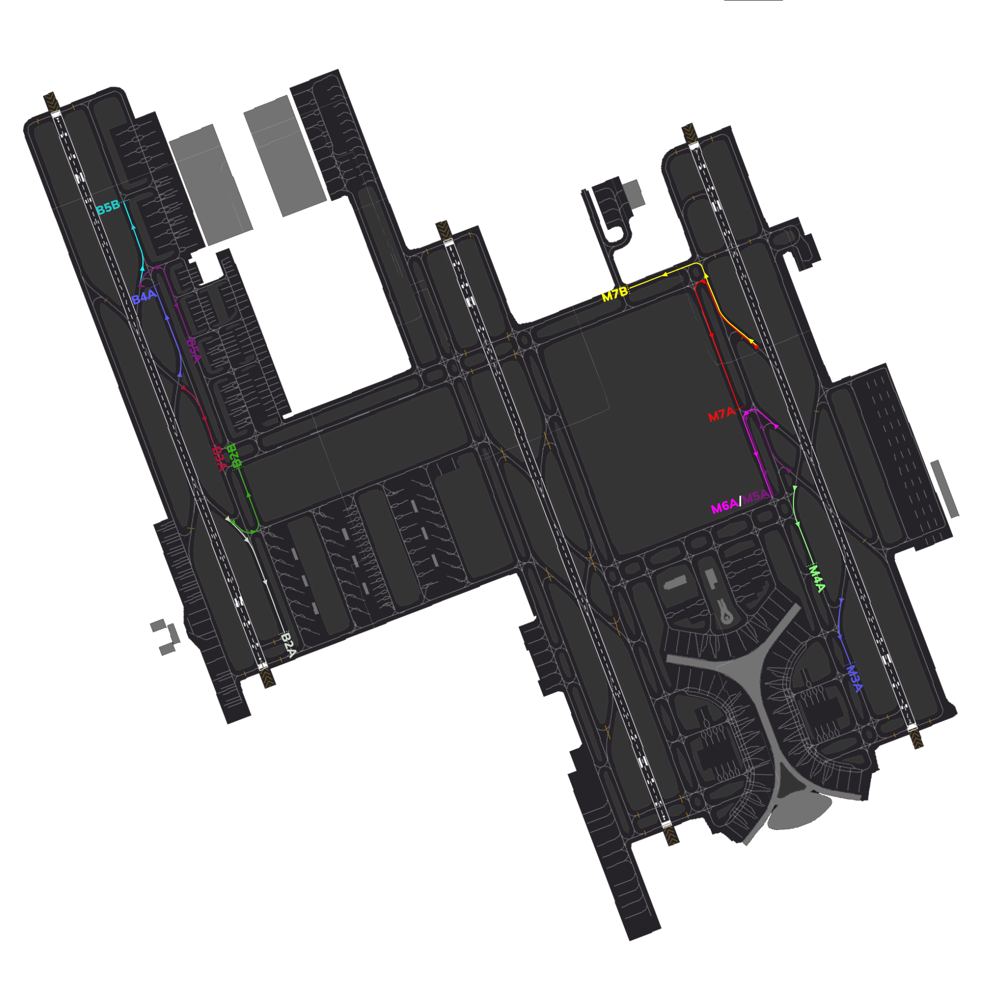

#   Jeddah Tower[OEJN_X_TWR]

This section details all the necessary Standard Operating Procedures for Tower Operations in **King Abdulaziz International Airport (OEJN)**

---

##  1. General Provisions

The Jeddah Air Control (AIR) is responsible for all aerodrome movements on runways and their associated taxiways. AIR shall also ensure separation between IFR aircraft that are arriving at and departing the aerodrome, as well as provide traffic information to VFR aircraft operating within the aerodrome control zone.

---

##  2. Designated Area of Responsibility
**King Abdulaziz International Airport (OEJN)** features two primary AIR positions, namely **AIR 1**, and **AIR 2**. The responsibilities and areas of control for each position are outlined as follows:

### 2.1. Airspace
**King Abdulaziz International Airport (OEJN)** Control Zone (CTR) is Class D airspace and is centered on the aerodrome. Its ceiling is 2500ft AGL and spans 10nm from the center.

### 2.2. AIR 1 [Jeddah Tower West]
**Jeddah Tower West [OEJN_1_TWR]** covers the western and center runways:

- 34L/16R
- 34C/16C

### 2.3. AIR 2 [Jeddah Tower East]
**Jeddah Tower East [OEJN_2_TWR]** covers the eastern runways:

- 34R/16L

### 2.4. Standard Connection Hierarchy 
Controllers must log in the following order to maintain realizm and follow SOPs: 

- AIR 1 [OEJN_1_TWR]
- AIR 2 [OEJN_2_TWR]

 This hierarchy of connection must always be followed unless ATS staff explictly permit you to do otherwise.

 ###    2.5. Splitting Positions

 ---

 ## 3. Departure procedures

 ###    3.1. Preferential runways
 Jeddah Tower is responsible for the direction of operations. In conditions of slack winds,--- operation is preferred up to a tailwind component of 6kts.

 ###    3.2. Departure points

 |       **Runway**       |     **Departure point**     |
|:------------------------:|:-----------------------:|
|        34L       |        B1 / U       |
|        34C       |        G1, G2 / H1, H2       |
|        34R       |        M1, M2 / N1       |
|        16L       |        M8, M9 / N9       |
|        16C       |        G6 / H7       |
|        16R       |        A7 / B7       |

  
*Table 3.2.1. - Departure points*

### 3.3. Line up clearances

Conditional line up instructions shall include the traffic that the aircraft is to follow, as well as the word “behind” at the beginning and end of the transmission.

**AIR:** “FAD123, Behind the departing Saudia A321, Via M1, line up runway 34R behind”

If aircraft have not yet reached the holding point where they are expected to line up at, ATC shall reiterate the cleared holding point.
Example: “SVA123, Via M1, line up runway 34R”

### 3.4. Take-off clearances

Aircraft shall be cleared for take-off once adequate separation exists

**Air:** “SVA123, wind 340 degrees 10knots, Rrunway 34R, cleared for take-off”

### 3.5. Independent parallell departure procedure

### 3.6. Separation requirements

Aircraft shall be separated on departure in compliance with standard IFR departure separation minima, standard wake turbulence separation or RE-CAT.

Succeeding aircraft on the same SID shall be separated by a minimum of 2 minutes.

VFR aircraft may be instructed to maintain visual separation with preceding aircraft and given a take-off clearance if no wake turbulence separation minima exists.

### 3.7. Low visibility and IMC

During low visibility operations and during IMC, departing aircraft shall not be cleared for take-off when there is an arriving aircraft within 4 NM of the landing runway threshold.

Additionally, conditional line up as stipulated in 3.3 should not be used when low visibility procedures are in force (LVPs)

Traffic should report **"airborne"** after take-off. Once airborne they should then be handed off to the appropriate station.

### 3.8. IFR handoff procedure

IFR departures shall be handed off to the appropriate departure controller as instructed.

### 3.9. Stopping a departure

If the departing aircraft has to abort takeoff, the Tower controller shall use the following
phraseology and instruct the aircraft twice. After the instruction, the Tower controller shall
confirm that the aircraft has acknowledged the cancel takeoff instruction.

This is a common occurrence on VATSIM when an aircraft randomly connects to the network while
on an active runway. Once conditions permit, if the aircraft needs to return to the end of
the runway for takeoff, the Tower controller shall instruct the aircraft to hold short of the
closest taxiway parallel to the active runway and hand off the aircraft to Ground.

*(Takeoff roll commenced)* **AIR:** "SVA123 stop immediately, I say again stop immediately. Aknowledge"

*(Takeoff roll not commenced)* **AIR:** "SVA123 hold position, cancel takeoff clearance. I say again cancel takeoff clearance, due ground crew on runway"

---

##  4. Arrival procedures

### 4.1. Preferred exit points

|       **Runway**       |     **Exit points**     |
|:------------------------:|:-----------------------:|
|        34L       |        B5, B8 / A5       |
|        34R       |        M4, M6, M7 / N5       |
|        16L       |        M3, M5 / N4       |
|        16R       |        B2, B4 / A2       |

  
*Table 4.1.1 - Preferred exit points*

On initial contact with AIR, traffic might be advised to expect an exit point along with a landing clearance.

**AIR:** "SVA123, expect vacate M6, winds 340 degrees 10kts, runway 34R, cleared to land"

### 4.2. Arrival taxi routes

Arrival Taxi Routes (ATRs) are short pre-defined initial taxi paths for traffic that are designed to maintain a smooth flow of traffic after aircraft vacate the runway. These routes are established to prevent traffic congestion around the RETs and to optimize the tower's efficiency by avoiding the need to provide initial taxiway instructions. Instead, the tower instructs the aircraft to follow one of the predetermined ATRs based on the assigned parking stand by the Ground (GND) controller.

This allows for a smooth and immediate transfer of traffic to the appropriate ground controller.

::::caution Do Note

The Tower controller is responsible for assigning the Arrival Taxi Route (ATR) to aircraft.
::::

####  4.2.1. 34 Arrival Taxi Routes
| **Arrival Taxi Route** | Runway |       Taxi Instructions       |     Handoff    |
|:----------------------:|--------|:-----------------------------:|:--------------:|
|           M4A          | 34R    | M, MA, L **Hold Short of V**  | AIR 2 to GMC 2 |
|           M6A          | 34R    | M, MA, L **Hold Short of V**  | AIR 2 to GMC 2 |
|           M7A          | 34R    |  M, S, L **Hold Short of MA** | AIR 2 to GMC 2 |
|           M7B          | 34R    |    M, R **Hold Short of J**   | AIR 2 to GMC 3 |
|           B3A          | 34L    |     B **Hold Short of B5**    | AIR 1 to GMC 1 |
|           B5A          | 34L    | D5, D3-W **Hold Short of B5** | AIR 1 to GMC 1 |
|           B5B          | 34L    |     B **Hold Short of D6**    | AIR 1 to GMC 1 |

  
*Table 4.2.1 - 34 Arrival Taxi Routes*

‎ ‎

::::caution
All Traffic Movements on M must give way to traffic vacating runway 34R/16L.
::::

####  4.2.2. 16 Arrival Taxi Routes
| **Arrival Taxi Route** | Runway |       Taxi Instructions       |     Handoff    |
|:----------------------:|--------|:-----------------------------:|:--------------:|
|           M5A         | 16L    | M  **Hold Short of MB**  | AIR 2 to GMC 2 |
|           M3A          | 16L    | M **Hold Short of MD**  | AIR 2 to GMC 2 |
|           B4A         | 16R    |  B **Hold Short of R** | AIR 1 to GMC 1 |
|           B2A          | 16R    |   B **Hold Short of B1**   | AIR 1 to GMC 1 |
|           B2B          | 16R    |     B, T, C **Hold Short of S**    | AIR 1 to GMC 1 |

  
*Table 4.2.2 - 16 Arrival Taxi Routes*

‎ ‎

::::caution
All Traffic Movements on B must give way to traffic vacating runway 34L/16R.
::::
####  4.2.3. Diagram of Arrival Taxi Routes

  
*Figure 4.2.3 - Arrival Taxi Routes Diagram*

---

### 4.4. Separation requirements

### 4.4.1. General
While the radar controllers are responsible for separating arriving aircraft, the AIR controller shall still ensure that minimum separation is maintained until the preceding aircraft crosses the runway threshold.

### 4.4.2. Speed control
AIR may use a tactical reduction in aircraft speed in order to ensure minimum separation between aircrafts.

**AIR:** SVA123, reduce to final approach speed.

### 4.4.3. Wake turbulence separation minima

### 4.4.4. Go around procedure

At any time should a runway become unsuitable for an aircraft landing, or separation minima in Figure 4.4.3. is not met, aircraft shall be instructed to go-around.

**AIR:** “SVA123, go around, I say again, go around, acknowledge”

Once aircraft have acknowledged the instruction and are observed to be safely climbing away, they shall be handed off to departure control.

Example: “SVA123, fly standard missed approach procedure, climb 4000 feet, contact Jeddah Approach 124.0”

---

##  5. VFR procedures

### 5.1. VFR departures

Any VFR aircraft leaving the control zone at Jeddah is considered to be engaging in cross-country VFR flight.

Coordination between the AIR and APP is required.

There are no specific restrictions, designated VFR routes, or prescribed exit points for VFR departures leaving the control zone at Jeddah.

::::info Do note

VFR Crosscountry traffic are considered as departures and shall depart from the active departure runway unless needed otherwise by AIR.

::::

### 5.2. VFR circuits

|     **Runway Configuration**      | **Direction** |   **Altitude(s)**            |
| :--: | :------------: | :-----------: |
| 34s |   Right Hand   |     1500ft     |
| 16s |   Left Hand    |     1500ft     |

::::info Jet Engine Aircrafts

Jet engine aircraft must  conduct circuits on the **western side of Runway 34L/16R** or the **eastern side of Runway 34R/16L**, maintaining ***1500/2000 feet***.

::::

### 5.3. VFR arrivals