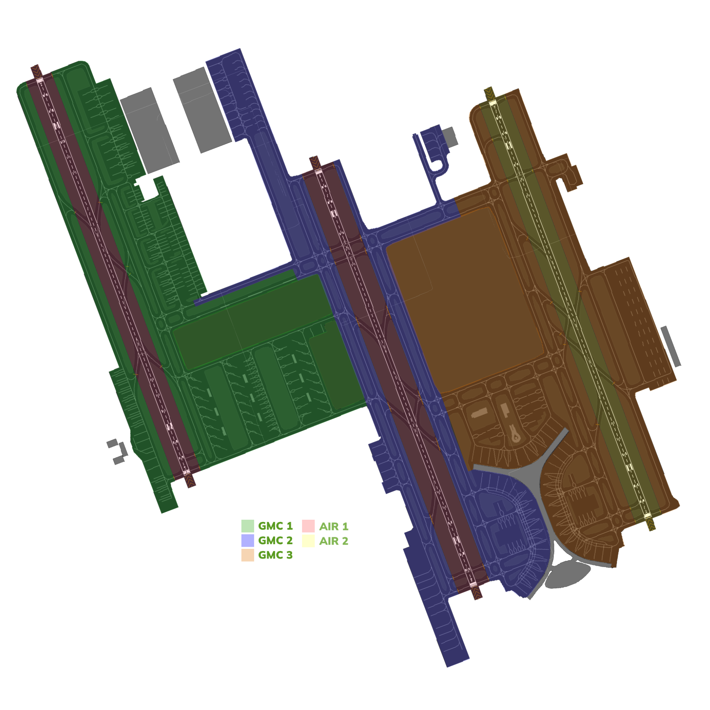

#   Jeddah Tower[OEJN_X_TWR]

This section details all the necessary Standard Operating Procedures for Tower Operations in **King Abdulaziz International Airport (OEJN)**

---

##  1. General Provisions

The Jeddah Air Control (AIR) is responsible for all aerodrome movements on runways and their associated taxiways. AIR shall also ensure separation between IFR aircraft that are arriving at and departing the aerodrome, as well as provide traffic information to VFR aircraft operating within the aerodrome control zone.

---

##  2. Designated Area of Responsibility
**King Abdulaziz International Airport (OEJN)** features two primary AIR positions, namely **AIR 1**, and **AIR 2**. The responsibilities and areas of control for each position are outlined as follows:

### 2.1. AIR 1 [Jeddah Tower West]
**Jeddah Tower West [OEJN_1_TWR]** covers the western and center runways:

- 34L/16R
- 34C/16C

### 2.2. AIR 2 [Jeddah Tower East]
**Jeddah Tower West [OEJN_2_TWR]** covers the eastern runways:

- 34R/16L

### 2.3. Standard Connection Hierarchy 
Controllers must log in the following order to maintain realizm and follow SOPs: 

- AIR 1 [OEJN_1_TWR]
- AIR 2 [OEJN_2_TWR]

 This hierarchy of connection must always be followed unless ATS staff explictly permit you to do otherwise.

 ###    2.4. Splitting Positions

 ---

 ## 3. Departure procedures

 ###    3.1. Preferential runways
 Jeddah Tower is responsible for the direction of operations. -- operation is preferred up to a tailwind component of 5kts.

 ###    3.2. Departure points

 |       **Runway**       |     **Departure point**     |
|:------------------------:|:-----------------------:|
|        34L       |        B1 / U       |
|        34C       |        G1, G2 / H1, H2       |
|        34R       |        M1, M2 / N1       |
|        16L       |        M8, M9 / N9       |
|        16C       |        G6 / H7       |
|        16R       |        A7 / B7       |

### 3.3. Line up clearances

### 3.4. Take-off clearances

### 3.5. Independent parallell departure procedure

### 3.6. Separation minima

### 3.7. Low visibility and IMC

### 3.8. IFR handoff procedure

##  4. Arrival procedures

### 4.1. General arrival procedures
Traffics are to exercise caution and vacate the runway through the preferred exit points.

### 4.2. Preferred exit points

### 4.3. Arrival taxi routes

### 4.4. Separation minima

####    4.4.1. go around procedure
####    4.4.2. go around simultaneous departure

##  5. VFR procedures

### 5.1. VFR departures

### 5.2. VFR circuits

### 5.3. VFR arrivals