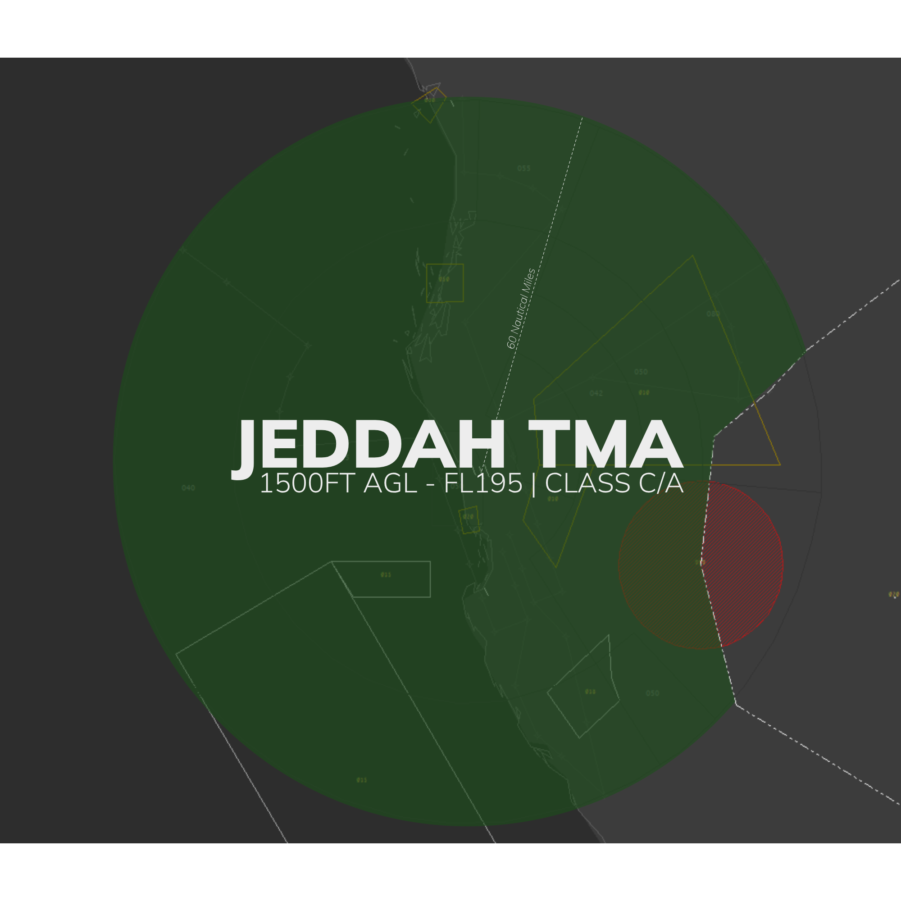
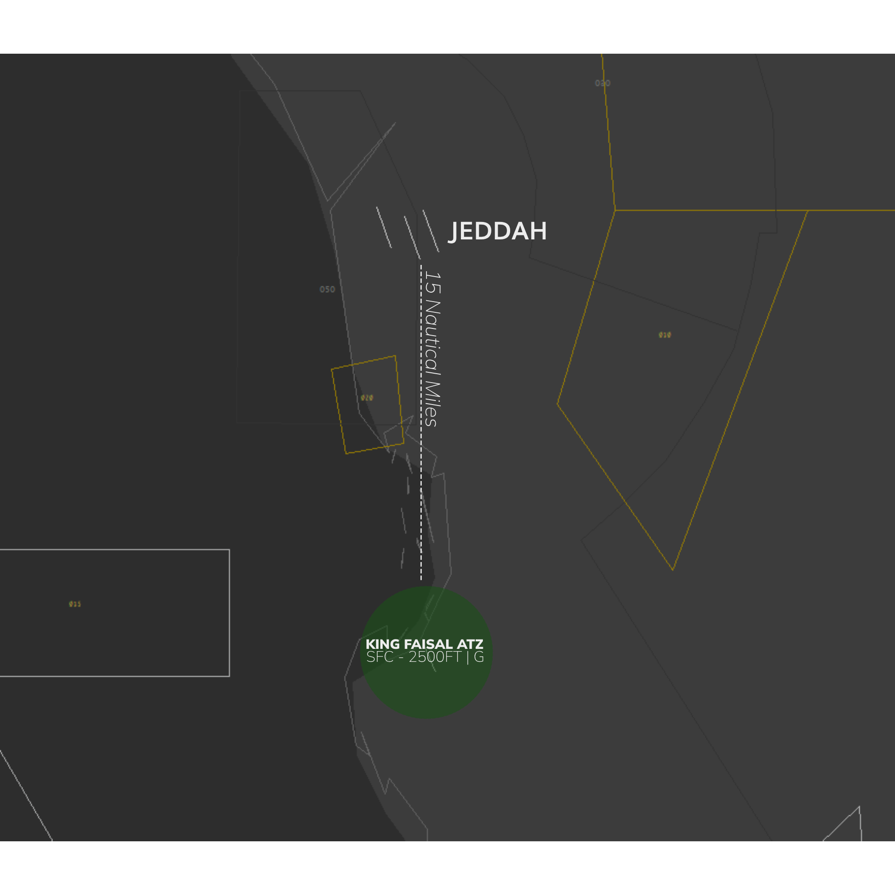
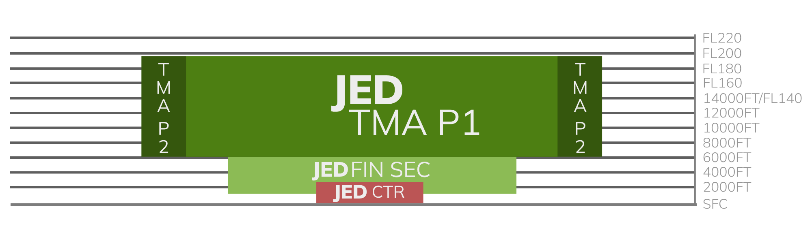
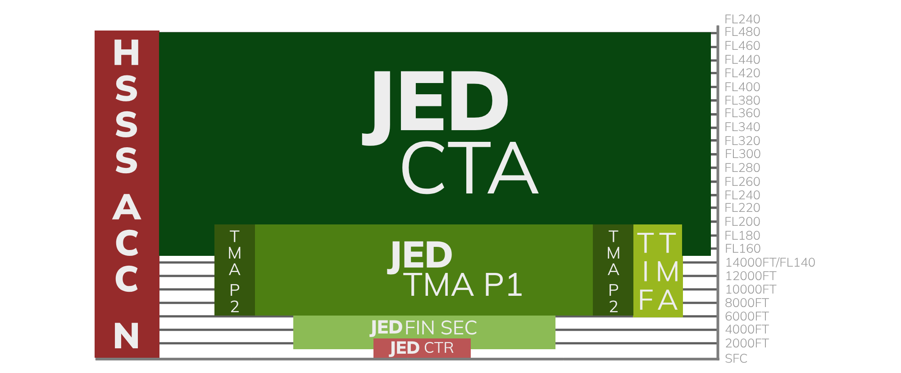
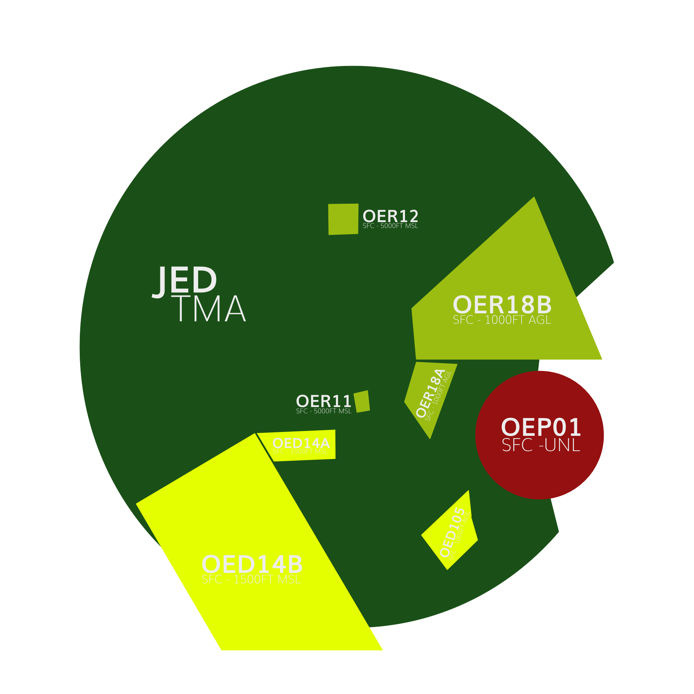
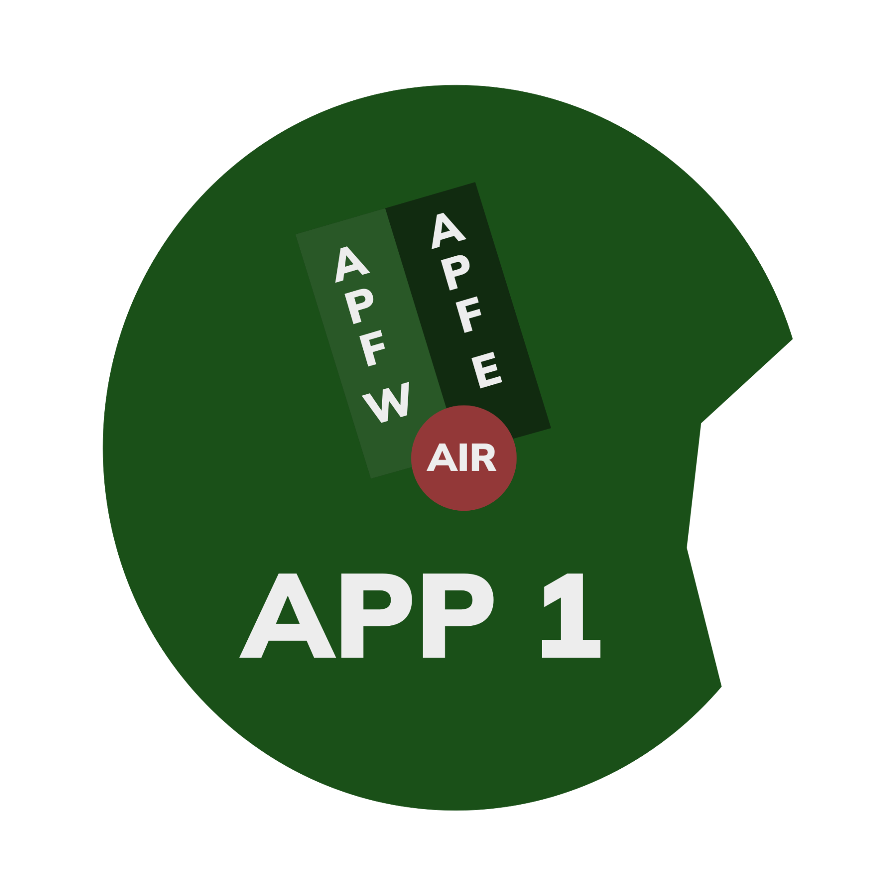

#   Jeddah Approach [OEJN_X_APP] 

This section details all the necessary Standard Operating Procedures for Approach Operations in **King Abdulaziz International Airport (OEJN)**

---

##  1. General Provisions

**Jeddah Approach Control (APP/FIN)** is tasked with handling the arrival and departure of aircraft at **King Abdulaziz International Airport** within the **Terminal Manevouring Area (TMA)**. Their responsibility includes maintaining adequate spacing and order to ensure safe and efficient operations.

---

##   2. Airspace

The **Jeddah Terminal Manevouring Area (TMA)** is an airspace classified as Class C/A that reaches up to FL195. This airspace encompasses the entirety of Jeddah city and the adjacent mountainous region within a 60 nautical mile radius.

  
*Figure 1.1 - Jeddah TMA*

###  2.1 Aerodromes Covered

The **Jeddah TMA** comprises **King Abdulaziz International Airport (OEJN)** and ***King Faisal Naval Base (OEJF)***.

King Faisal Naval Base (OEJF) is a controlled naval airbase that features an Aerodrome Traffic Zone (ATZ) surrounding the airport's vicinity.

  
*Figure 1.2 - King Faisal ATZ*

###  2.2 Airspace Sectorization

###  2.2.1 Lateral View

  
*Figure 1.3 - Jeddah TMA Sectorization - Lateral View*

###  2.2.1 Vertical View

  
*Figure 2.3 - Jeddah TMA Sectorization - Vertical View*

###  2.3 Surrounding Airspace
#### 2.3.1 Lateral View 

  
*Figure 2.3 - Surrounding Airspaces - Lateral view*

#### 2.3.1 Vertical View 

  
*Figure 2.3 - Surrounding Airspaces - Vertical view*

###  2.4 Restricted Airspace

  
*Figure 1.4 - Restricted Areas*

#### 2.4.1 Prohibited Areas

A prohibited area is a designated area above a country's land or territorial waters where aircraft flight is completely prohibited at all times under any circumstances.

| **Identification & Name** | **Vertical Limits** |     **Remarks**    |
|:-------------------------:|:-------------------:|:------------------:|
|      **OEP01 MAKKAH**     |      SFC - UNL      | Permanent. Makkah. |

  
*Table 1.1 - Prohibited Areas in the Jeddah TMA*

#### 2.4.2 Restricted Areas

Restricted airspace is a designated area above a state's land or territorial waters where aircraft flights are regulated based on specific conditions. Civil aircraft can fly in this airspace only if certain requirements are met, such as specified times, meteorological conditions, or special permissions.

| **Identification & Name** | **Vertical Limits** | **Remarks** |
|:-------------------------:|:-------------------:|:-----------:|
|     **OER18B JEDDAH**     |   SFC - 1000FT AGL  |  Permanent. |
|     **OER18A JEDDAH**     |   SFC - 1000FT AGL  |  Permanent. |
|      **OER11 JEDDAH**     |   SFC - 5000FT AMSL  |  Permanent. |
|      **OER12 JEDDAH**     |   SFC - 5000FT AMSL  |  Permanent. |

  
*Table 1.2 - Restricted Areas in the Jeddah TMA*

#### 2.4.1 Areas of Danger

A danger area is a specified area where activities posing a risk to aircraft flight may occur at certain times. This term is used when the potential danger does not warrant the airspace being classified as restricted or prohibited. By designating a danger area, operators and pilots are cautioned to assess the risks and take responsibility for ensuring the safety of their aircraft.

| **Identification & Name** | **Vertical Limits** |             **Remarks**             |
|:-------------------------:|:-------------------:|:-----------------------------------:|
|      **OED14B OEJN**      |  SFC - 1500FT AMSL  | Military. VFR helicopter operation. |
|      **OED14A OEJN**      |  SFC - 1500FT AMSL  | Military. VFR helicopter operation. |
|      **OED105 OEJN**      |  SFC - 1800FT AMSL  |          Firing. Permanent          |

  
*Table 1.2 - Areas of Danger in the Jeddah TMA*

###  2.5 Minimum Radar Vectoring Altitude (MRVA)
###  2.6 Transitional Layer

---

##  3.  ATS Positions

These are the ATS Positions that concern this document. They will be further refered with their listed abbreviation.

|        Radio Callsign        | Logon Callsign | Abbreviation | Frequency |
|:----------------------------:|:--------------:|:------------:|:---------:|
|         Jeddah Tower         |   OEJN_1_TWR   |     AIR 1    |  118.200  |
|         Jeddah Tower         |   OEJN_2_TWR   |     AIR 2    |  118.500  |
|        Jeddah Approach       |    OEJN_APP    |     APP 1    |  124.000  |
|       Jeddah Final East      |   OEJN_FE_APP  |     FIN E    |  123.800  |
|       Jeddah Final West      |   OEJN_FW_APP  |     FIN W    |  124.675  |
| Jeddah Final Monitor Control |  OEJN_FMC_APP  |     FMC 1    |  125.850  |
|    Jeddah Terminal Control   |   OEJN_1_CTR   |     CTR 1    |  125.450  |
|    Jeddah Terminal Control   |   OEJN_2_CTR   |     CTR 2    |  119.100  |
|        Jeddah Control        |   OEJD_1_CTR   |     ACC 1    |  126.500  |
|        Jeddah Control        |   OEJD_1_CTR   |     ACC 2    |  133.900  |

  
*Table 1.3 - ATS Positions*

---

## 4. Designated Areas of Responsiblity (DAOR)
### 4.1 34s DDRO/SDRO Configuration
In the 34s Config, APP 1 covers the two parts of the TMA as usual and APF E covers the 34 FIN SEC East and the APF W covers the 34 FIN SEC West.

  
*Figure 1.6 - DOAR 34 Configuration*

### 4.2 16s DDRO/SDRO Configuration
In the 16s Config, APP 1 covers the two parts of the TMA as usual and APF E covers the 16 FIN SEC East and the APF W covers the 16 FIN SEC West.

  
*Figure 1.6 - DOAR 16 Configuration*

### 4.1 Sector Top-Down Coverage
### 4.2 Standard Connection Hierarchy 
Controllers must log in the following order to maintain realizm and follow SOPs: 

- APP 1 [OEJN_APP]
- APF E [OEJN_FE_APP]
- APF W [OEJN_FW_APP]
- FMC 1 [OEJN_FMC_APP]

 This hierarchy of connection must always be followed unless ATS staff explictly permit you to do otherwise.
 
---

## 5.  General Separation Minimas
### 5.1 Surveillance-Based Separation
### 5.2 Wake Turbulence Separation

---

##   6. Procedures
### 6.1 Arrival Procedures
####    6.1.1 STAR Allocation 
####    6.2.1 Point To Merge System
####    6.1.2 Approach and Runway Assignment
#####   6.1.2.1 Instrument Approach
#####   6.1.2.2 Visual Approach
#####   6.1.2.3 Change of Approach Type/Runway
####    6.1.3 Descend Profiles
#####   6.1.3.1	Initial Segment of the STAR
#####   6.1.3.2	Final Segment of the STAR
######   6.2.3.2.1 High/Low Side
####    6.1.3 Speed Control
#####   6.1.3.1	Initial Segment of the STAR
#####   6.1.3.2	Final Segment of the STAR
####    6.1.4 Lateral Profile
#####   6.1.4.1 Standard Shortcuts
####    6.1.4 Final Approach Sequencing
#####   6.1.4.1 Platform Altitudes
####    6.1.6 Independent Parallel Approaches (Mode 1)
#####   6.1.6.1 Separation Requirements
#####   6.1.6.2 High Side
#####   6.1.6.3 Low Side
	
### 6.2 Departures Procedures
####    6.2.1 Climb Profile
####    6.2.2 Speed Control
####    6.2.3 Lateral Profile
#####   6.2.3.1 Standard Shortcuts
### 6.3 Separation

### 6.3 Handoff Procedures
####    6.2.2 Arrivals
####    6.2.3 Departing Aircrafts

---

## 7. Final Approach Monitering (OEJN_FMC_APP)