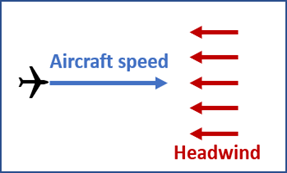
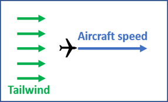
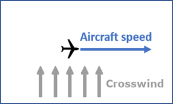
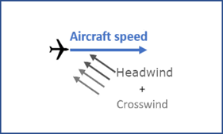
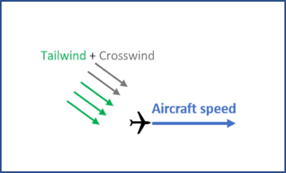

Prior to takeoff and landing, pilots carefully consider the wind conditions as a crucial factor. It is preferable for aircraft to operate in conditions where they can take off and land into the wind, known as headwinds. This approach helps reduce the necessary speeds for becoming airborne during takeoff and for safely coming to a stop after landing.

***Minimum take-off and landing speed***

All aircraft strive to take off against the wind due to the principles of reaction and aerodynamics. When taking off into headwinds, the force exerted on the wings generates an upward thrust, enabling the aircraft to achieve liftoff at a reduced speed. The same principle applies during landing, where headwinds allow the aircraft to land at lower speeds by utilizing the upward thrust caused by the winds.

***Winds with respect to the aircraft’s direction***

- **Headwind**

When the wind opposes the aircraft's direction of movement, it is referred to as a headwind.

- **Tailwind**

When the wind blows in the same direction as the aircraft's movement, it is referred to as a tailwind.

- **Crosswind**

When the wind blows perpendicular to the aircraft's direction of movement, it is referred to as a crosswind.

  
 